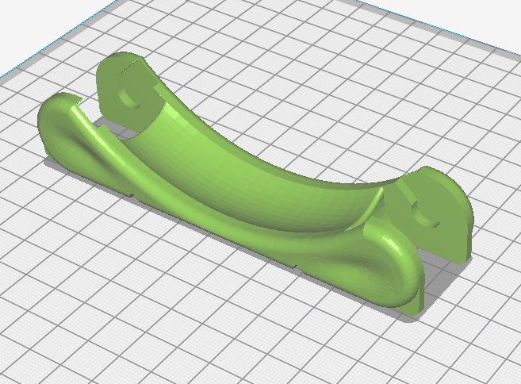
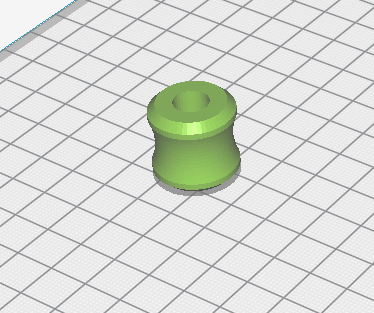

# B2X300 - Spool Holder

This is the recommended spool holder for your **B2X300** 3D printer.
It is recommended for spools from 330 g up to 2 Kg and for spools ranging from 35mm to 120mm wide.

For your **B2X300**, we recommend you print 2 spool holders, one for each extruder.

---

## Printing Settings
You should print the spool holder in a rigid material with the following settings:
- Layer height: 0.2mm
- Outer walls: 3
- Infill density: 15%

The estimated printing time is around `7h 30m`.

> Please note that you might need to change the orientation of some parts so they can print with correctly. Please check below for the recommended orientation.

## Printed Parts

You need the following parts to complete **one** spool holder:

| Quantity | File name                       | Picture                      |
| -------- | ------------------------------- | ---------------------------- |
| 2x       | `Spool_Support_Base.STL`        |  |
| 1x       | `Spool_Support_Rail.STL`        |  |
| 4x       | `Spool_Support_Wheel.STL`       |  |
| 4x       | `Spool_Support_Wheel_Shaft.STL` |  |

## Renders

---

### Contributing
To get help regarding this part, please open an issue on [GitHub](https://github.com/beeverycreative/B2X300-resources/issues) or open a post on [BEEVERYCREATIVE's User Forum](https://beeverycreative.com/forum/).

If you wish to contribute, please open a pull request.
