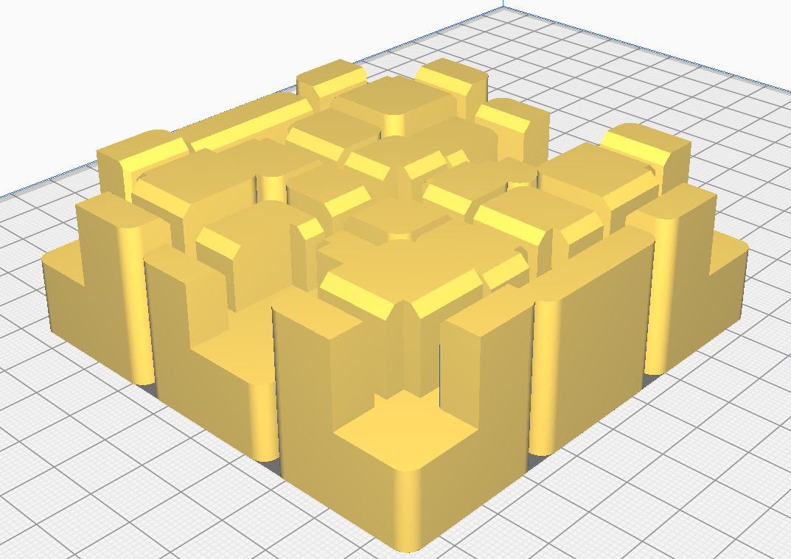
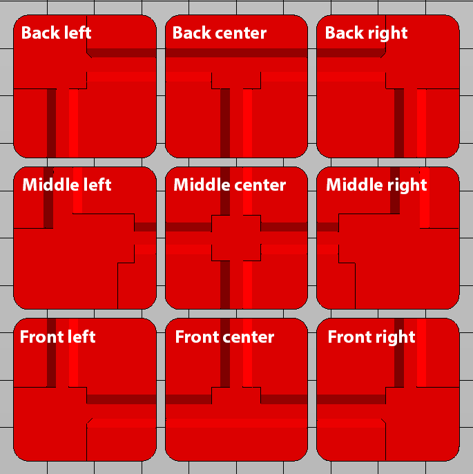

# B2X300 - Frame Feet

This is the recommended Frame Feet for your **B2X300** 3D printer.
It was designed so it would reinforce the corners of the base structure and allow the frame to sit more stably on a flat surface. We recommend you print the feet if the printer is unstable or as a stability upgrade. After printing the feet, we recommend gluing some soft foam on the bottom of each feet to reduce the printer's vibration on the surface it sits on.

---

## Printing Settings
You should print the Frame Feet in a rigid material (we recomend BEEVERYCREATIVE's `Tele Grey`), or hard TPU with the following settings:
- Layer height: 0.3mm
- Outer walls: 3
- Infill density: 15%

The estimated printing time is around `10h 25m`.

## Printed Parts

There is only one part you need to print:

| Quantity | File name                       | Picture                      |
| -------- | ------------------------------- | ---------------------------- |
| 1x       | `Frame_feet_all.stl`            |    |

* There is a 3mf version of the file if you want to print any part separately

## How to use

The feet will print in their corret position relative to the printer, as shown here:

They might require some force to fit onto the frame, if necessary, slightly sand the slots where the frame fits into and use a rubber mallet to push them into place.

---

### Contributing
To get help regarding this part, please open an issue on [GitHub](https://github.com/beeverycreative/B2X300-resources/issues) or open a post on [BEEVERYCREATIVE's User Forum](https://beeverycreative.com/forum/).

If you wish to contribute, please open a pull request.
