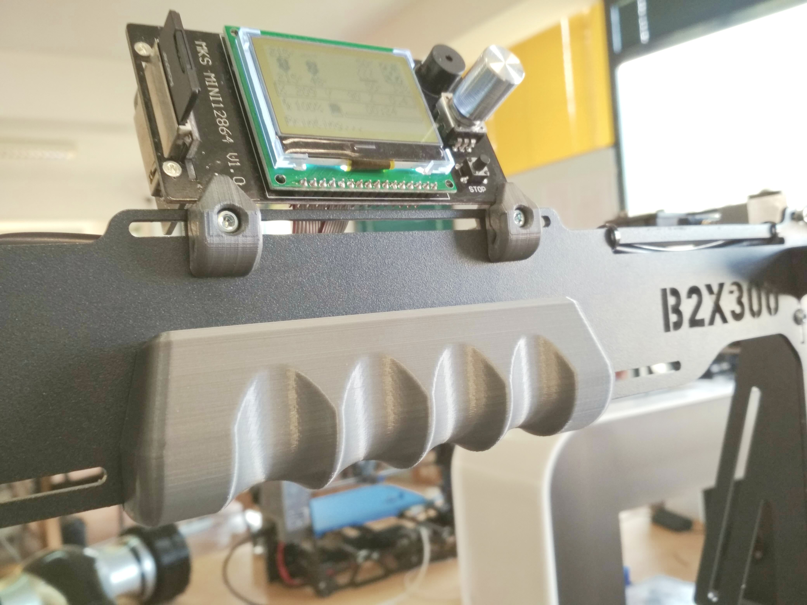

# B2X300 - Frame Handle

This is the recommended Frame Handle for your **B2X300** 3D printer.
It was designed so it is more comfortable when you need to move your B2X300. we recommend you print one if you plan on moving your printer frequently or when you need to hold for more than a few minutes (during transport, for example).

---

## Printing Settings
You should print the spool holder in a rigid material (we recomend BEEVERYCREATIVE's `Tele Grey`) with the following settings:
- Layer height: 0.3mm
- Outer walls: 3
- Infill density: 15%

The estimated printing time is around `1h 45m`.

> Please note that you might need to change the orientation of some parts so they can print with correctly. Please check below for the recommended orientation.

## Printed Parts

There is only one part you need to print:

| Quantity | File name                       | Picture                      |
| -------- | ------------------------------- | ---------------------------- |
| 1x       | `Frame_handle_V02.stl`            |    |

## How to use

The handle should be placed right below the LCD display and should fit tightly around the frame. Check the picture below for clarification: 

---

### Contributing
To get help regarding this part, please open an issue on [GitHub](https://github.com/beeverycreative/B2X300-resources/issues) or open a post on [BEEVERYCREATIVE's User Forum](https://beeverycreative.com/forum/).

If you wish to contribute, please open a pull request.
