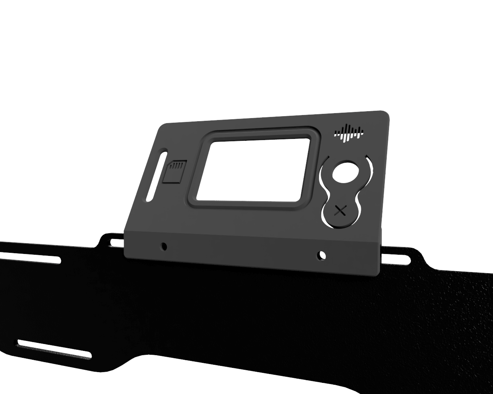

# B2X300 - LCD Cover

This is the recommended LCD Cover for your **B2X300** 3D printer.
It was designed to improve the looks of your B2X300 and to keep the dust out of the LCD. We recommend you print one to make the LCD more stable, specially during the SD card insertion and removal and when using the click wheel to navigate the menus.

---

## Printing Settings
You should print the LCD cover in a rigid material (we recomend BEEVERYCREATIVE's `Tele Grey` PLA) with the following settings:
- Layer height: 0.2mm
- Wall Line Count: 3
- Infill density: 0%

The estimated printing time is around `2h 45m` and it uses around 20 grams of PLA.

You can use BEEVERYCREATIVE's Cura PLA printing profile with the above modifications in order to achieve great printing results.

## Printed Parts

There is only one part you need to print:

| Quantity | File name                   | Picture       |
| -------- | --------------------------- | ------------- |
| 1x       | `B2X300_LCD_cover_v1.3.stl` | (check below) |

 

## How to use

Before assembling the LCD on your B2X300, first make sure it is turned off.

1. To install the LCD, disconnect the 2 flat cables that connecto the LCD to the control board and remove the 2 support 3D printed parts that attach the LCD to the printer frame, by unscrewing the 2 screws and nuts.
2. Remove the button cover by pulling firmly.
3. With the new LCD cover facing down place the LCD inside this part making sure the LCD slot and the encoder/button are properly aligned. The 4 mounting holes on the LCD should be more or less aligned with the screw holes on the LCD cover you printed.
4. Make sure you have 4 cylindrical head screws at hand  (`M3x10` size - 3mm diameter, 10mm length) which were provided with your B2X300 kit but weren't used on the assembly. Using these, screw the LCD to the cover on the 4 mounting holes located in each corner on the back of the LCD. Do not overtight the screws beacause that might damage the LCD.
5. Re-attach the button cover by pushing it gently against the button shaft. Make sure that the rotation and click movements aren't obstructed.
6. It is now time to place the LCD on the frame (the slot on the printed part should fit tightly on the frame of the printer). Make sure it is centered and then use the screws and nuts from step #1 to firmly attach the LCD to the frame (again, don't overtighten them because that will damage the LCD cover).

This should be the look of the printer with the LCD assembled:

---

### Contributing
To get help regarding this part, please open an issue on [GitHub](https://github.com/beeverycreative/B2X300-resources/issues) or open a post on [BEEVERYCREATIVE's User Forum](https://beeverycreative.com/forum/).

If you wish to contribute, please open a pull request.
