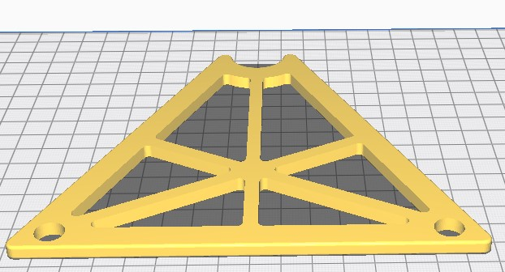
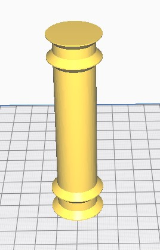
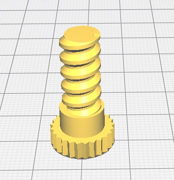
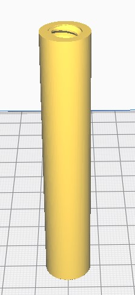

# B2X300 - Spool Holder 1Kg

This is a alternative spool holder for your **B2X300** 3D printer.
It is recommended to use with regular 1kg spools as it allows easier replacement and a very good stability during prints.

For your **B2X300**, we recommend you print 2 spool holders, one for each extruder.

---

## Printing Settings
You should print the spool holder in a rigid material with the following settings:
- Layer height: 0.2mm
- Outer walls: 3
- Infill density: 15%

The estimated printing time is around `10h 30m`.

> Please note that you might need to change the orientation of some parts so they can print with correctly. Please check below for the recommended orientation.

## Printed Parts

You need the following parts to complete **one** spool holder:

| Quantity | File name                       | Picture                          |
| -------- | ------------------------------- | ----------------------------     |
| 2x       | `Spool_holder_1kg_main_body.stl`|   |
| 1x       | `Spool_holder_1kg_axis.stl`     |        |
| 2x       | `Spool_holder_1kg_screw.stl`    |       |
| 2x       | `Spool_holder_1kg_spacer.stl`   |      |

Alternately you can use the "Spool_Holder_1kg_full_set.3mf" file which contains all models already pre-placed and ready to slice. Please keep in mind that some slicer do not open 3MF files correctly and can cause the parts to be placed incorrectly or even outside the bed.

## Renders

---

### Contributing
To get help regarding this part, please open an issue on [GitHub](https://github.com/beeverycreative/B2X300-resources/issues) or open a post on [BEEVERYCREATIVE's User Forum](https://beeverycreative.com/forum/).

If you wish to contribute, please open a pull request.
