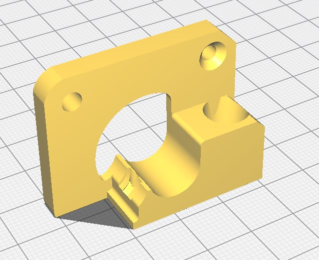
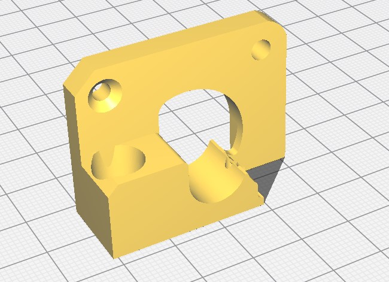
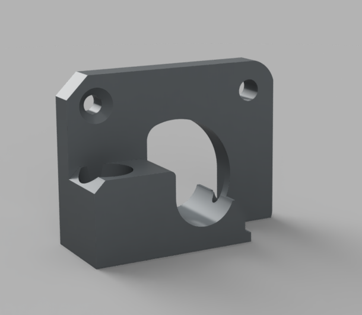
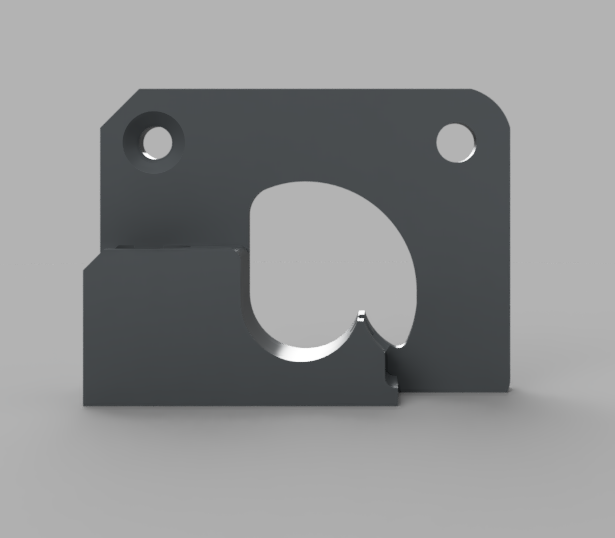
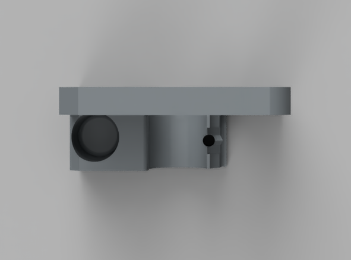

# B2X300 - TPU Adapter

This is a improved extruder filament guider for the **B2X300** 3D printer.
It is recommended to use this part when printing with TPU/Nylon filaments as they reduce the likeliness of filament escaping after the extruder's traction wheel.

For your **B2X300**, we recommend you print both the adapters, one for each extruder.

The default version should work for most flexible materials, in some cases due to higher ambient temperatures and/or softer filaments some printers require a adapter with tighter tolerance, please test the default version first before trying the tighter tolerance as it is harder to assemble into the printer.

---

## Printing Settings
You should print the TPU adapter in a rigid material that can whitstand at least 70ºC, for example PETG/ASA with the following settings:
- Layer height: 0.1mm
- Outer walls: 4
- Infill density: 30%
- Supports: Active

The estimated printing time is around `04h 42m`.

> Please note that you might need to change the orientation of some parts so they can print with correctly. Please check below for the recommended orientation.

## Printed Parts

| Quantity | File name                       | Picture                          |
| -------- | ------------------------------- | ----------------------------     |
| 1x       | `TPU Adapter E1.stl`            |   |
| 1x       | `TPU Adapter E2.stl`            |   |

## Renders

---

## Tighter tolerance version
You should print the TPU adapter in a rigid material that can whitstand at least 70ºC, for example PETG/ASA with the following settings:
- Layer height: 0.1mm
- Outer walls: 4
- Infill density: 30%
- Supports: Active

The estimated printing time is around `08h 04m`.

Due to the very tight tolerances on the files, you should use a 1.9-2mm drill to clear the filament hole on both the arm and adapter, before assembling. This ensures the filament load/unload will work as expected.

The original filament V groove bearing must be transfered to the the new arm, ensure the hole for the bearing is clean of any stringing or residue from the printing process. Secure the bearing in place using a M3x10mm FHC screw.

| Quantity | File name                       |
| -------- | ------------------------------- |
| 1x       | `Tighter TPU Adapter E1.stl`    |
| 1x       | `Tighter TPU Adapter E2.stl`    |
| 1x       | `Tighter TPU Adapter Arm E1.stl`|
| 1x       | `Tighter TPU Adapter Arm E2.stl`|

---

### Contributing
To get help regarding this part, please open an issue on [GitHub](https://github.com/beeverycreative/B2X300-resources/issues) or open a post on [BEEVERYCREATIVE's User Forum](https://beeverycreative.com/forum/).

If you wish to contribute, please open a pull request.
