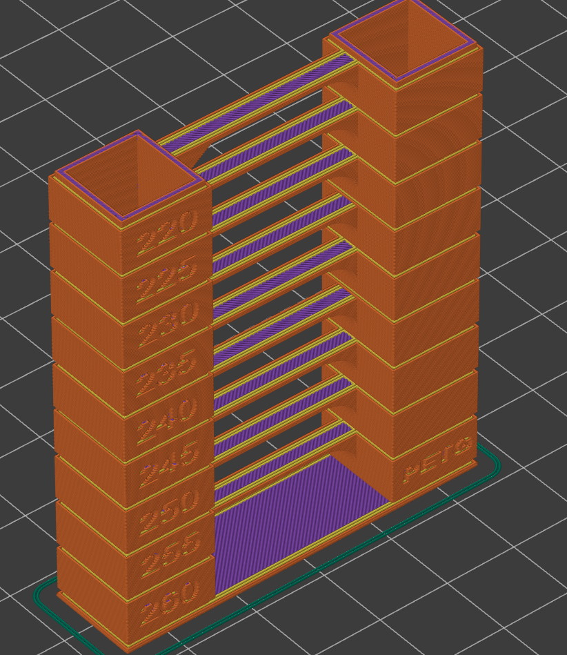

# B2X300 - Temperature_tower test Gcodes

These are pre-sliced and ready to use temperature tower Gcodes for the **B2X300** 3D printer.
The files are ready to print, just place the files on the SDcard, ensure the correct filament is loaded on the correct extruder and select "Print" on the LCD screen and select the file.

---

## Included files
 File name                                              | Characteristics                      |
 -------------------------------                        | ----------------------------         |
 `B2X300_E1_190-230_PLA_Temp_Tower.gcode`               | Prints with E1 meant to be used with PLA filament     |
`B2X300_E1_220-260PETG_Temp_Tower_.gcode`               | Prints with E1 meant to be used with PETG filament     |
`B2X300_E2_190-230_PLA_Temp_Tower.gcode`               | Prints with E2 meant to be used with PLA filament     |
`B2X300_E2_220-260PETG_Temp_Tower.gcode`               | Prints with E2 meant to be used with PETG filament     |

---

## Analyzing the results
Allow the complete print of the temperature tower.

The resulting print should look similar to this, the PETG temperature tower is shown here

Analyze the various print temperature zones, identified by the temperature written on the left side of the model and select the one with the best finish and consistency. If various temperatures show similar print results, select the one closest to the base of the object as hight print temperatures lead to better adhesion between layers and usually reduce clogs and other issues.

The estimated printing time is around `2h 15m`.

---

### Contributing
To get help regarding this part, please open an issue on [GitHub](https://github.com/beeverycreative/B2X300-resources/issues) or open a post on [BEEVERYCREATIVE's User Forum](https://beeverycreative.com/forum/).

If you wish to contribute, please open a pull request.
